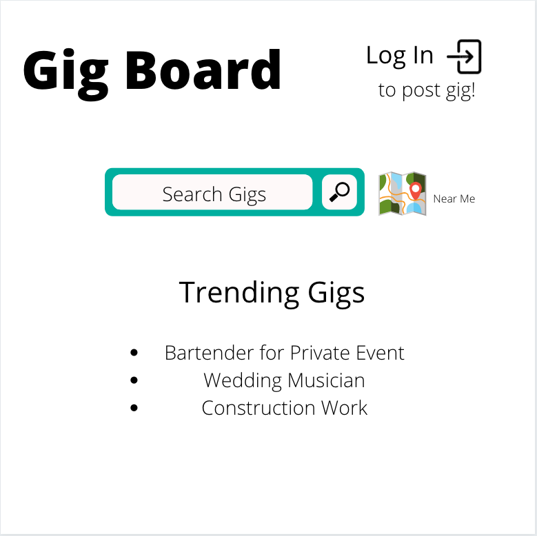
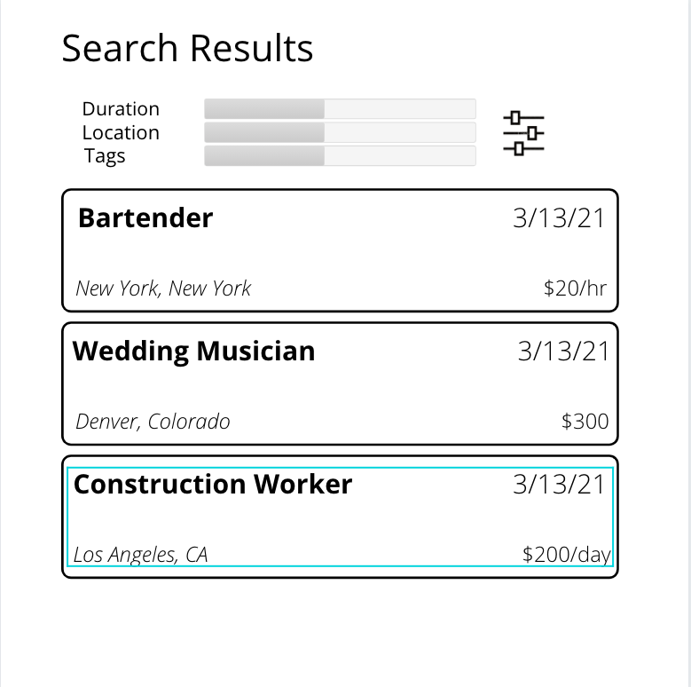
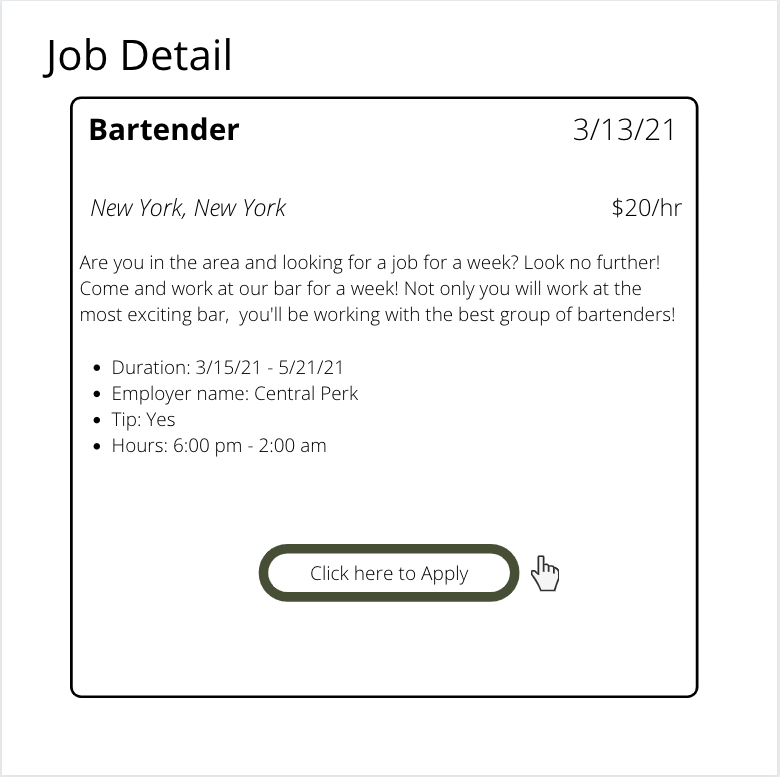
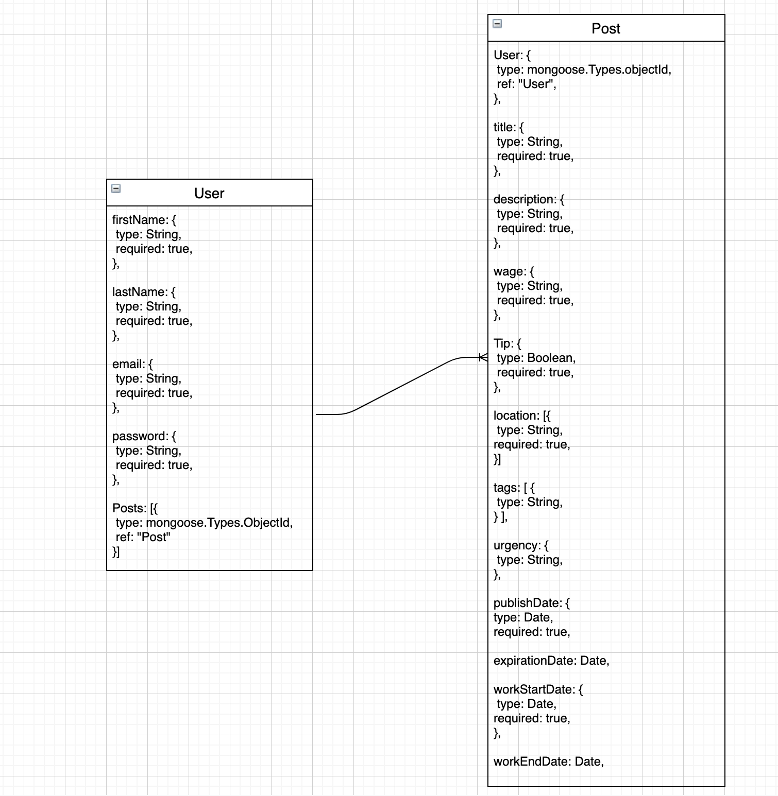

# Gigboard

## README

Gig board is a job posting app specific for gigs.

The gig poster is going to be able to log-in, view gigs posted by others, and view gigs posted by themselves.

The gigs will have specific categories or “tags” that will show you what type of work the gig involves (whether it’s bartending, playing music, mechanic work, etc…)

The job poster is able to specify how many positions they have available for that specific gig

_[Future Goals]_

Create a gig seeker who will be able to view available gigs

The gig seeker will be able to view gigs in their area, as well as filter them through tags

As the gig seeker “claims” a gig, the available gigs positions will decrease

### UX/Stories

- 1 log-in (job poster)
  - Eventual 2 log-in (job poster / job seeker)
- As a job poster
  - Log-In
  - Post a job
    - Title
    - Description
      - Start Date & End Date
        - Include times
      - Requirements
    - Wage
    - Tip (yes/no)
    - Tag
      - Categories it fits in to (Service, Entertainment, Sports, Health/Wellness, General, Automotive)
  - Delete a job
  - Edit a job
  - Number of positions available for that gig
  - Add location
    - Map API, Weather API
      - Map API will require a package
  - Urgency of the specific position

### Tech Stack

- React
- Express
- MongoDB
- Node
- Heroku (deploy)
- Bootstrap & Sass

### Repos

- [Frontend](https://github.com/benhammondmusic/gigboard) - current repo
- [Backend API](https://github.com/benhammondmusic/gigboard-backend/)

### Wireframes

